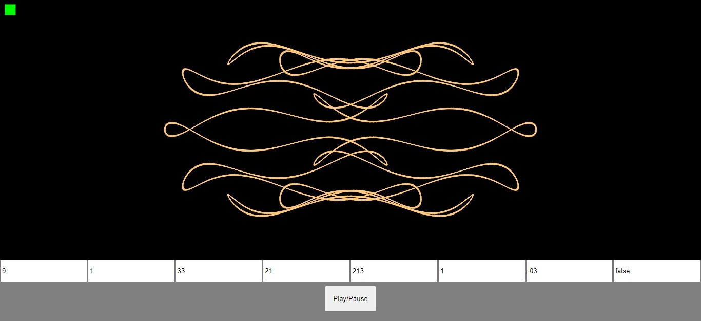
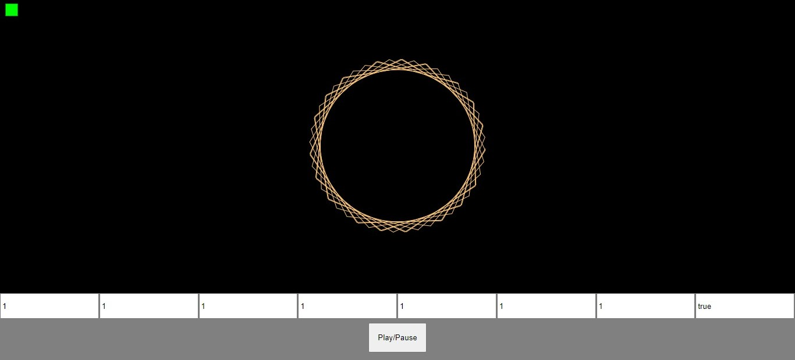

# "Noice"

This project is just for test 
If you have any suggestions to improve this project feel free to pull up a issue 
It uses p5.js library for visualizing and stuff 

# How to use
<a href ="https://harsh-uppal.github.io/Noice">Run Noice</a> 
Change the values in the text boxes to see the result 
Play/Pause button is to pause and play the simulation. 

#Screenshots

 
 

# Made by : Harsh Uppal
Copyright © Harsh
